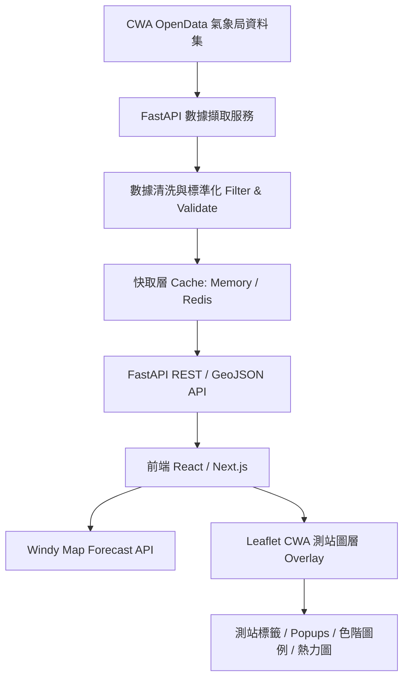

# 🌤️ 台灣中央氣象署 (CWA) 氣溫廣播視覺化地圖 (Windy API + Leaflet)

[](https://fastapi.tiangolo.com/)
[](https://nextjs.org/)
[](https://api.windy.com/)
[](https://opendata.cwa.gov.tw/)
[](mailto:Wesleycho0628@gmail.com)
[](LICENSE)

本專案結合 **中央氣象署 (CWA) 開放資料 API**、**FastAPI 後端快取/正規化服務** 與 **Windy Map Forecast API + Leaflet 前端地圖圖層**，實現台灣即時氣溫廣播與氣象觀測數據動態視覺化地圖系統。

---

## 📌 目錄 (Table of Contents)

- [專案簡介 (Overview)](#-專案簡介-overview)
- [核心目標 (Goal)](#-核心目標-goal)
- [架構設計 (System Architecture)](#-架構設計-system-architecture)
- [技術選型 (Recommended Tech Stack)](#-技術選型-recommended-tech-stack)
- [開發代辦事項 (TODO List & Roadmap)](#-開發代辦事項-todo-list--roadmap)
- [專案目錄結構 (Suggested Directory Structure)](#-專案目錄結構-suggested-directory-structure)
- [環境變數設定 (Environment Variables)](#-環境變數設定-environment-variables)
- [授權與貢獻 (License & Author)](#-授權與貢獻-license--author)

---

## 📖 專案簡介 (Overview)

在物聯網（AIoT）與智慧氣象應用中，專業的天氣地圖（如 Windy）能提供優異的氣候背景（風場、雲層、降雨、氣溫模型圖層），而中央氣象署（CWA）提供全台自動氣象站實體觀測資料。

本專案將 **Windy 地圖作為天氣背景圖層**，並利用 Leaflet 在其上疊加 **CWA 實測氣溫圖層（圓形標籤、即時數值、測站彈出視窗 Popup 與熱力圖）**，提供精確且直觀的即時氣溫廣播地圖。

---

## 🎯 核心目標 (Goal)

1. **風場/天氣底圖與實測數據疊加**：以 Windy 動態風場地圖為底圖，於全台座標繪製 CWA 測站氣溫標籤。
2. **顏色編碼 (Temperature Color Scale)**：依據氣溫高低（例如 `<10°C` 至 `>35°C`）以漸層色彩呈現，並隨附色階圖例 (Legend)。
3. **測站詳細資訊彈出窗 (Popup)**：點擊測站顯示 測站名稱、縣市、鄉鎮、氣溫、相對濕度、風速與最新觀測時間。
4. **自動更新與快取機制**：後端每 10 分鐘自動對接 CWA API，前端自動刷新保持最新觀測時間。
5. **後端金鑰保護與數據清洗**：隱藏 CWA API Key，過濾無效測站數據（如 `-99` 缺值與極端異常值）。

---

## 🏗️ 架構設計 (System Architecture)



---

## 🛠️ 技術選型 (Recommended Tech Stack)

### 後端 (Backend)
- **Python 3.11+**
- **FastAPI**：高效能非同步 API 框架
- **httpx**：非同步 HTTP 請求庫
- **Pydantic**：資料結構驗證與模型
- **APScheduler / Cron**：定期自動更新背景任務
- **Redis**（可選）：分散式快取

### 前端 (Frontend)
- **Next.js / Vite + React + TypeScript**
- **Windy Map Forecast API**：動態天氣地圖背景
- **Leaflet 1.4.x**：客製化 CWA 測站 Marker、標籤與 Popup
- **Leaflet.markercluster / Leaflet.heat**（可選）：圖層聚類與熱力圖渲染

---

## 📋 開發代辦事項 (TODO List & Roadmap)

詳細的階段性開發任務請參考 [TODO.md](TODO.md) 檔案：

- [x] **系統架構規劃與設計文件** (`design.md`)
- [ ] **Phase 1: MVP 核心功能**
  - [ ] FastAPI CWA 資料擷取、過濾與 GeoJSON 端點 (`GET /api/temperature/latest`)
  - [ ] Windy API + Leaflet 全台地圖顯示與 CWA 測站圖層渲染
  - [ ] 氣溫色階圖例 (Legend) 與測站 Popup 資訊窗
- [ ] **Phase 2: Dashboard 儀表板與互動增強**
  - [ ] Windy 圖層切換器（風場 / 降雨 / 雲層 / 氣溫）
  - [ ] 縣市選單與測站名稱搜尋功能
  - [ ] 前端 5 分鐘自動刷新機制
- [ ] **Phase 3: 高級視覺化**
  - [ ] 全台氣溫場熱力圖模式 (Heatmap Overlay)
  - [ ] 歷史氣溫時間軸滑桿 (Time Slider)
- [ ] **Phase 4: 營運部署 (Production)**
  - [ ] Redis 快取與 PostgreSQL/PostGIS 整合
  - [ ] 部署至 Vercel (前端) + Render/Fly.io (後端)

完整與詳細的工作項目請見 👉 **[TODO.md](TODO.md)**

---

## 📁 專案目錄結構 (Suggested Directory Structure)

```text
cwa-windy-temperature/
│
├── README.md           # 專案主說明文件
├── TODO.md             # 開發代辦事項清單
├── design.md           # 系統架構設計規格書
├── .gitignore          # Git 忽略檔案設定
│
├── backend/            # FastAPI 後端專案
│   ├── app/
│   │   ├── main.py
│   │   ├── config.py
│   │   ├── routers/ (temperature.py, health.py)
│   │   ├── services/ (cwa_client.py, temperature_service.py)
│   │   └── schemas/ (temperature.py)
│   ├── requirements.txt
│   └── .env.example
│
└── frontend/           # React / Next.js 前端專案
    ├── src/
    │   ├── components/ (WindyMap.tsx, TemperatureLayer.tsx, TemperatureLegend.tsx)
    │   ├── lib/ (windyLoader.ts, cwaApi.ts, colorScale.ts)
    │   └── types/ (temperature.ts)
    ├── package.json
    └── .env.example
```

---

## 🔐 環境變數設定 (Environment Variables)

### 後端 (`backend/.env`)
```env
CWA_API_KEY=your_cwa_api_key_here
CWA_DATA_URL=https://opendata.cwa.gov.tw/api/v1/rest/datastore/O-A0001-001
CACHE_TTL_SECONDS=600
```

### 前端 (`frontend/.env.local`)
```env
NEXT_PUBLIC_WINDY_API_KEY=your_windy_api_key_here
NEXT_PUBLIC_API_BASE_URL=http://localhost:8000
```

---

## 📜 授權與貢獻 (License & Author)

- **專案作者 (Author)**: [Wesley0628c](https://github.com/Wesley0628c)
- **聯絡 Email**: [Wesleycho0628@gmail.com](mailto:Wesleycho0628@gmail.com)
- **GitHub 儲存庫**: [https://github.com/Wesley0628c/AloT_L3_CWA_HW1](https://github.com/Wesley0628c/AloT_L3_CWA_HW1)
- **授權條款 (License)**: 本專案採用 [MIT License](LICENSE) 授權方式。
