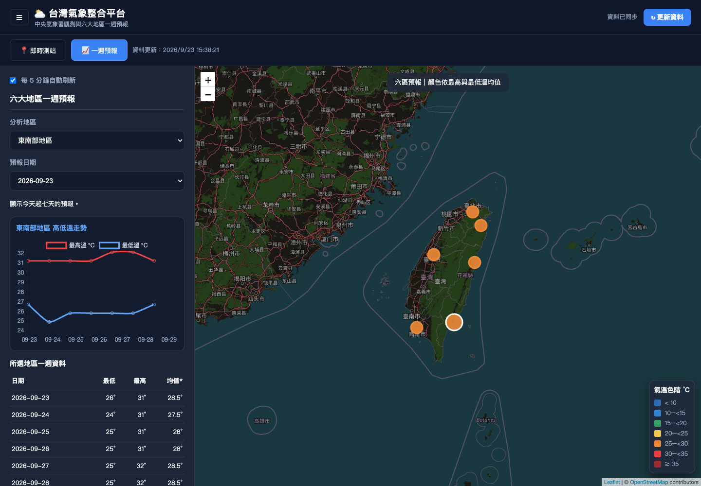

# 台灣氣象整合平台

將中央氣象署全台測站觀測與六大地區一週預報整合到同一個網站。後端使用 FastAPI 與 SQLite，前端使用 Leaflet、Chart.js 和原生 JavaScript。




## 啟動

建議 Python 3.11 或更新版本（亦通過本機 Python 3.9 測試）。

```bash
python3 -m venv .venv
source .venv/bin/activate
pip install -r requirements.txt
cp .env.example .env
```

在根目錄 `.env` 填入自己的 `CWA_API_KEY`，接著：

```bash
python -m uvicorn app.main:app --app-dir backend --host 127.0.0.1 --port 8000
```

開啟 http://127.0.0.1:8000 。macOS/Linux 可執行 `./start_server.sh`；Windows 可執行 `start_server.bat`。啟動腳本需先完成套件安裝。

## 已整合功能

- **即時測站**：`O-A0001-001` 自動站與 `O-A0003-001` 局屬站；測站數依當次 API 有效資料而定。
- **一週預報**：`F-C0032-003` 六區預報；地區、日期選單，最高／最低溫折線圖，一週資料表、當日六區總覽與地圖。
- **日期範圍**：使用台灣時區，只顯示今天起七天；更新資料時以交易替換預報，避免舊日期累積。
- **搜尋**：縣市篩選，以及測站名稱、編號、縣市、鄉鎮搜尋。
- **地圖**：測站標籤、熱力圖、聚類，深色／街道底圖與一致的七段溫度圖例。
- **測站 Popup**：氣溫、濕度、風速、雨量、觀測時間；缺值明確顯示為無資料。
- **排行與提示**：依目前篩選範圍顯示最高溫 Top 5、≥33°C／≤15°C 測站數。這是應用程式門檻提示，並非 CWA 官方特報。
- **更新**：後端啟動後立即抓取，之後每 10 分鐘背景更新；前端每 5 分鐘刷新，可關閉並手動更新。
- **資料狀態**：顯示最後成功更新時間、過期／部分資料狀態；失敗不冒充成功更新。
- **歷史觀測**：成功更新的測站快照存入 SQLite，保留最近七天；拖動滑桿回看，支援返回最新觀測。歷史資料從啟動後開始累積，清單最多 1008 份。
- **CSV 下載**：最新測站觀測、所選地區一週預報；UTF-8 BOM、CSV 引號處理與試算表公式跳脫。
- **SQL 查詢**：唯讀 SELECT、最多 500 筆、執行成本限制。
- **手機操作**：可收合控制面板，地圖與預報共用同一網站。

預報的「均值」為 `(最高溫 + 最低溫) / 2`，不是實測日平均溫。熱力圖是測站氣溫權重與密度視覺化，不是氣象模型內插等值面。

## Windy 天氣模型（選配）

在 `.env` 設定自己的 `WINDY_API_KEY` 並重新啟動，即使用 Windy Map Forecast API，在同一張地圖上切換風場、氣溫模型、降雨及雲層，並保留 CWA 圓點圖層。

未設定時使用一般 Leaflet 底圖，不會將海圖或衛星照片誤標為風場。Windy 需要有效的 Map Forecast API key 與允許的網域；此 key 依 SDK 設計會傳到瀏覽器，請設定網域限制。CWA key 僅留在後端。

參考：[Windy 官方文件](https://api.windy.com/map-forecast/docs)。依其要求使用 Leaflet 1.4.0。未提供 Windy key 的環境只能驗證一般地圖路徑，無法驗證 Windy 帳號授權。

## 設定

| 環境變數 | 預設／用途 |
|---|---|
| `CWA_API_KEY` | 必填；從 CWA 開放資料平台取得 |
| `CACHE_TTL_SECONDS` | `600`，最小 60 秒 |
| `BACKGROUND_REFRESH` | `true`；測試可關閉 |
| `DATABASE_PATH` | `backend/data.db`；可指定持久化磁碟位置 |
| `WINDY_API_KEY` | 選填；Windy Map Forecast key |

先讀根目錄 `.env`，再讀 `backend/.env`；既有環境變數優先。不可將 `.env` 或 API key 提交到 GitHub。

## API

| 路徑 | 功能 |
|---|---|
| `/api/health` | 程式與快取狀態 |
| `/api/temperature/latest?refresh=true` | 最新觀測／強制更新 |
| `/api/temperature/geojson` | GeoJSON |
| `/api/temperature/stations/{station_id}` | 單站資料 |
| `/api/temperature/export/csv` | 最新觀測下載 |
| `/api/temperature/history` | 歷史快照索引 |
| `/api/temperature/snapshot?at=...` | 指定快照 |
| `/api/forecasts/regions` | 六大地區 |
| `/api/forecasts/chart?region=中部地區` | 七天預報與更新狀態；`refresh=true` 強制更新 |
| `/api/forecasts/table` | 同一來源的預報表格 |
| `/api/forecasts/export/csv?region=中部地區` | 預報下載 |
| `/api/forecasts/sql-query?query=SELECT...` | 唯讀查詢 |
| `/docs` | FastAPI 互動式 API 文件 |

## 資料與既有版本

新增 `WeeklyForecasts`、`UpdateMetadata`、`ObservationSnapshots` 三張資料表。初始化不會刪除原有 `TemperatureForecasts`、`CountyForecasts`、`StationObservations`；新預報介面統一讀取 `WeeklyForecasts`，舊表仍可透過唯讀 SQL 查詢。

執行中的 `backend/data.db` 不再提交到 Git。新安裝會自動建立資料庫；原有本機資料庫可繼續使用。舊版 `probe_cwa_api.py`、`gate2_database.py` 與 `gate1_output.json` 保留為作業流程參考，不是新版網站啟動所需步驟。

## 驗證

```bash
pip install -r requirements-dev.txt
python -m pytest tests -q
node --check frontend/js/app.js
```

測試以暫存 SQLite 與模擬 API 執行，不需要 CWA key；覆蓋日期範圍、零度／缺值、快取失敗、重啟備援、歷史保留、CSV、唯讀 SQL，以及 HTTP 端點。

瀏覽器實際驗證紀錄與範圍見 [VALIDATION.md](VALIDATION.md)。GitHub Actions 會執行後端測試與 JavaScript 語法檢查。

## 部署範圍

本專案可在本機或具備持久化磁碟的 Python 主機執行。GitHub 儲存庫用於版本管理與 CI；推送 GitHub 不會自動建立公開網站。GitHub Pages 無法執行此 Python 後端。當前版本採單一服務程序與 SQLite，未整合 Redis、PostgreSQL 或指定雲端服務。
