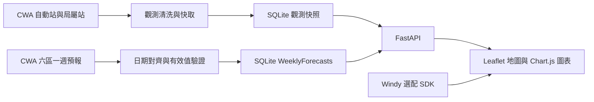

# 整合架構

服務啟動時以 FastAPI lifespan 建立資料表與背景更新工作，關閉時取消工作。每 600 秒更新觀測與預報；鎖避免同一服務中的並行請求重複抓取。快取失敗後一般查詢至少等待 60 秒才重試，手動更新可立即重試。

預報限制台灣時區今天起七天，只有每日六區完整且有有效高低溫的資料才以 SQLite 交易取代現行預報。若只有部分日期，介面顯示實際天數。既有資料過期時不將日期重新貼成今天。

觀測成功更新後儲存完整快照與擷取時間；原始觀測時間另保留在每個測站。失敗時沿用快取，重新啟動可恢復最後快照。快照保留七天。資料缺失、極端值、非有限數值與無效座標會被過濾。

前端每五分鐘取得後端狀態。查看歷史時不被自動刷新切回最新，使用者可明確返回即時資料。圖表、資料表、下載與地圖共用後端預報資料。

Windy key 未設定時使用一般 Leaflet 底圖；不提供名稱與內容不符的假風場。Windy 模型時間與 CWA 觀測／預報時間彼此獨立，介面有明確提示。

單程序服務搭配 SQLite 適用於本機與小型部署。未宣稱提供分散式快取或多實例排程。
