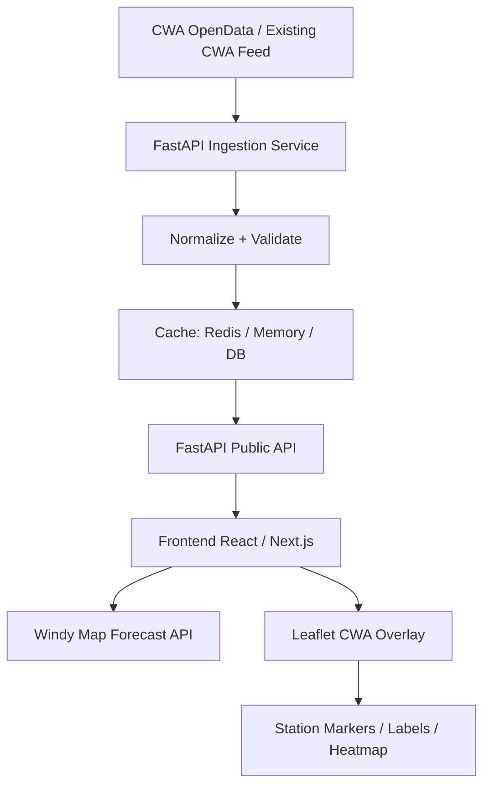

# Design: CWA Temperature Broadcast Visualization with Windy API

## 1. Project Overview

This project visualizes Taiwan CWA temperature broadcast / observation data on top of a Windy weather map.

The system uses:

* **CWA OpenData** as the trusted weather observation source.
* **FastAPI** as the backend API and data-normalization layer.
* **Windy Map Forecast API** as the interactive weather-map background.
* **Leaflet overlay layers** to render custom CWA temperature data on top of Windy.

Windy’s Map Forecast API is based on Leaflet 1.4.x, and Windy’s own documentation states that the Windy map object is a Leaflet map instance. This means we can use normal Leaflet features to draw our own CWA markers, labels, popups, and heatmap layers on top of the Windy map.

---

## 2. Goal

Build a real-time or near-real-time Taiwan temperature visualization system.

The first version should support:

1. Displaying a Windy map centered on Taiwan.
2. Loading latest CWA temperature observations from backend API.
3. Drawing CWA station temperatures as colored map markers.
4. Showing station name, county, town, temperature, humidity, wind, and observation time in popups.
5. Refreshing data automatically.
6. Providing a simple legend for temperature color ranges.
7. Allowing the user to switch Windy background layers, such as wind, rain, clouds, or temperature.

---

## 3. Why Windy + Leaflet

Windy should be treated as the **weather context layer**, not as the storage or rendering engine for our CWA data.

Windy gives us:

* Professional-looking weather-map background.
* Built-in weather overlays.
* Map controls.
* Forecast/weather context.
* Wind, rain, cloud, and temperature model layers.

Leaflet gives us:

* Custom station markers.
* Custom CWA temperature labels.
* Popups.
* GeoJSON support.
* Layer groups.
* Future heatmap or canvas overlays.

Windy’s documentation says the Map Forecast API lets developers customize Windy map visualizations with their own content and imagery, and that the map itself provides interactivity such as zooming, dragging, moving, and click handling.

---

## 4. Data Source

### 4.1 CWA Observation Data

The CWA automatic weather station dataset includes fields such as:

* `StationName`
* `StationId`
* `DateTime`
* `StationLatitude`
* `StationLongitude`
* `StationAltitude`
* `CountyName`
* `TownName`
* `Weather`
* `Precipitation`
* `WindDirection`
* `WindSpeed`
* `AirTemperature`
* `RelativeHumidity`
* `AirPressure`
* `PeakGustSpeed`

The dataset update frequency is every 1 hour and is published under Taiwan’s Open Government Data License, version 1.0.

### 4.2 Backend Responsibility

The frontend should not directly depend on the raw CWA format.

The backend should:

1. Fetch or receive CWA data.
2. Normalize field names.
3. Remove invalid records.
4. Convert strings to numbers.
5. Cache the latest result.
6. Expose clean JSON APIs for the frontend.

---

## 5. Architecture



---

## 6. Recommended Tech Stack

### Backend

* Python 3.11+
* FastAPI
* httpx
* Pydantic
* APScheduler or cron job
* Redis cache, optional
* PostgreSQL/PostGIS, optional for historical data

### Frontend

* Next.js or Vite + React
* Windy Map Forecast API
* Leaflet
* TypeScript
* Optional: Leaflet.markercluster
* Optional: Leaflet.heat or custom Canvas layer

---

## 7. Backend Design

### 7.1 Main Backend Modules

```text
backend/
  app/
    main.py
    config.py
    routers/
      temperature.py
      health.py
    services/
      cwa_client.py
      temperature_service.py
      cache_service.py
    schemas/
      temperature.py
    jobs/
      refresh_cwa_data.py
```

---

## 8. Backend Data Model

### 8.1 Normalized Temperature Observation

```python
from pydantic import BaseModel
from datetime import datetime

class StationTemperature(BaseModel):
    station_id: str
    station_name: str
    county: str | None = None
    town: str | None = None

    lat: float
    lon: float
    altitude_m: float | None = None

    observed_at: datetime
    temperature_c: float

    humidity_percent: float | None = None
    pressure_hpa: float | None = None
    wind_speed_mps: float | None = None
    wind_direction_deg: float | None = None
    precipitation_mm: float | None = None
    weather: str | None = None
```

---

## 9. Backend API Endpoints

### 9.1 Latest Temperature

```http
GET /api/temperature/latest
```

Returns all valid latest station observations.

### 9.2 GeoJSON Temperature Layer

```http
GET /api/temperature/geojson
```

Returns data in GeoJSON format for Leaflet.

### 9.3 Station Detail

```http
GET /api/temperature/stations/{station_id}
```

### 9.4 Health Check

```http
GET /api/health
```

---

## 10. Data Validation Rules

Backend should remove or ignore records when:

1. Latitude or longitude is missing.
2. Temperature is missing.
3. Temperature cannot be parsed as number.
4. Temperature is outside a reasonable range (`-20°C` to `50°C`).
5. Station ID is missing.
6. Observation time is invalid.

---

## 11. Frontend Design & Windy Map Integration

Windy Map Forecast API requires Leaflet first, then `libBoot.js`.
Leaflet `LayerGroup` handles custom CWA station markers, popups, and custom color scale rendering.

---

## 12. Implementation Roadmap

- **Phase 1: MVP**: FastAPI endpoint, Windy map Taiwan view, CWA station markers, color legend, popup detail.
- **Phase 2: Dashboard**: Auto refresh, County filter, Station search, Windy layer switcher, Station label toggle, Health check endpoint.
- **Phase 3: Advanced Visualization**: Heatmap mode, Time slider, Historical playback, Alert threshold coloring, Mobile UI.
- **Phase 4: Production**: Redis cache, Postgres/PostGIS, Rate limiting, Logging, Deployment.
