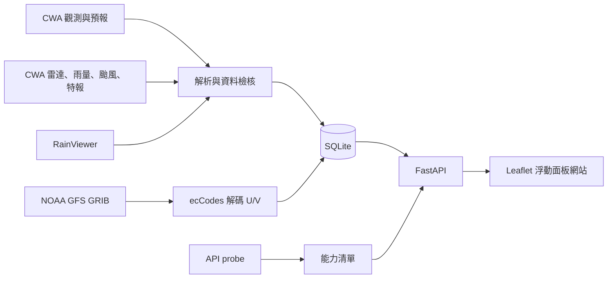

# 架構

唯一專案：`AloT_L3_CWA_HW1`。唯一執行資料庫：`data/weather.db`。前後端由同一 FastAPI 服務提供，不需跨域設定或第二套啟動流程。

- `sources.py` 集中定義 API，probe 與執行服務使用同一份來源設定。
- `temperature_service.py` 處理兩份測站來源、去重、清洗與歷史快照。
- `forecast_service.py` 提供台灣日期今天起七天的六區預報，完整的每日六區資料才會覆寫 SQLite。
- `products.py` 是無網路的解析邏輯；`weather_service.py` 分別快取產品，單一來源失敗不影響其他圖層。
- `wind_service.py` 選擇已發布的 GFS 批次，下載小範圍 10 m U/V，解碼後以由北到南的規則格點供前端取樣。
- 雷達 metadata 經主機與範圍驗證後下載 PNG；只有固定允許的官方主機可被讀取。
- `ProductCache` 儲存產品與成功更新時間；`ObservationSnapshots` 保留七天觀測。失敗沿用原成功時間並回報 stale。
- `frontend/js/app.js` 管理互動，`map.js` 管理 Leaflet，`wind.js` 以雙線性取樣呈現風場；時間與來源不混用。

唯讀 SQL 使用 SQLite read-only 連線、query-only 模式、回傳 500 筆限制與執行成本限制。API key 只保留在後端環境；來源例外不輸出含授權碼的 URL。

背景工作隨 FastAPI lifespan 啟停，僅排程能力清單中已通過 probe 的附加產品。單一服務程序用 asyncio lock 防止同一產品並行重複抓取，尚未實作分散式排程。
